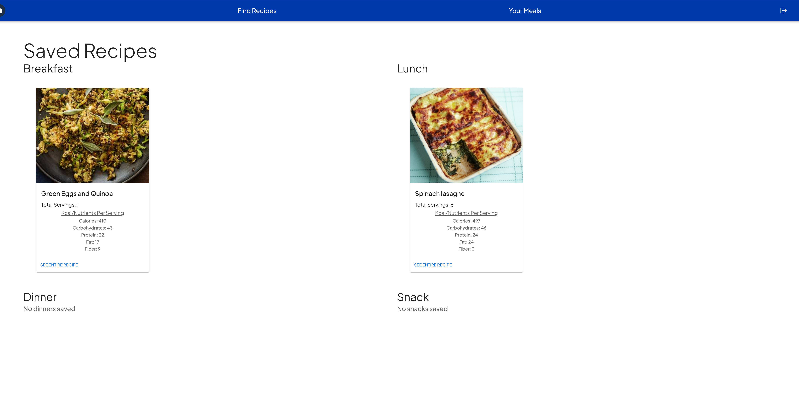

# Diabetes Recipe Nutrition Calculator

A full-stack web application that takes in your weight, height, age, gender, and activity level and then gives you how many Calories and more importantly carbohydrates you should eat per day. It also allows you to search for recipes with your foods of choice that match these ranges. Helps solve the difficulty of finding recipe ideas that match a certain carbohydrate goal to keep your blood sugar levels stable. Created by a Registered Dietitian so you can be sure that provided ranges fall within a healthy range.

## Features & Usage

-  Authentication system using express-sessions and bcrypt for password hashing/salting.
-  Calculates recommended total calories and carbohydrates per day after user enters their metrics, which get stored in database
-  Allows user to manually update calorie and carbohydrate range without entering metrics
-  Lists recommended calorie and carbohydrate goal per meal
-  After calorie and carbohydrates are entered, allows user to enter any food and a meal type, and then provides recipes that match calorie and carb range for this specific meal
-  If user finds recipe they enjoy, they can then save specific recipe to their account

## Potential Features

-  Allow user to view how many calorie/carbs they have left after saving meal
-  Allow user to enter allergie information

## Demo




## Tech Stack

This project was built using custom webpack.config.js and the following technologies:


## Setup/ Installation

-  Clone this repository and navigate to project directory in the terminal
-  Then, run development server:

```bash
npm run server-dev
```

-Then, have webpack serve your static files:

```bash
npm start
```

## Resources

-  [Edamam API](https://www.edamam.com/?gclid=Cj0KCQjwyMiTBhDKARIsAAJ-9VuwvU8TGmj1rEfWavPwrBSU-tzk-fxHe4yFU5UdpV77PwDeHZWFwYMaAukDEALw_wcB)
