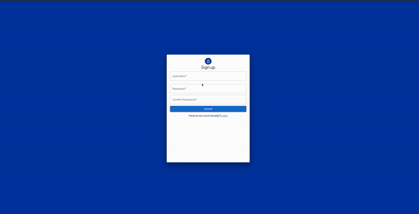

# Diabetes Recipe Nutrition Calculator

A full-stack web app that takes in metrics such as your height and weight, and then gives you how many calories and carbs you should eat per day. Then you can search for recipes with a specific ingredient that match these ranges. Helps solve the difficulty of finding recipes that match a certain carb goal to keep your blood sugar levels stable.

## Features & Usage

-  Authentication system using express-sessions and bcrypt for password hashing/salting.
-  Calculates recommended total calories and carbohydrates per day after user enters their metrics, which get stored in database
-  Allows user to manually update calorie and carbohydrate range without entering metrics
-  Lists recommended calorie and carbohydrate goal per meal
-  After calorie and carbohydrates are entered, allows user to enter any food and a meal type, and then provides recipes that match calorie and carb range for this specific meal

## Demo




## Tech Stack

This project was built using custom webpack.config.js and the following technologies:


## Setup/ Installation

-  Clone this repository and navigate to project directory in the terminal
-  Then, run development server:

```bash
npm run server-dev
```

-Then, have webpack serve your static files:

```bash
npm start
```

## Resources

-  [Edamam API](https://www.edamam.com/?gclid=Cj0KCQjwyMiTBhDKARIsAAJ-9VuwvU8TGmj1rEfWavPwrBSU-tzk-fxHe4yFU5UdpV77PwDeHZWFwYMaAukDEALw_wcB)
